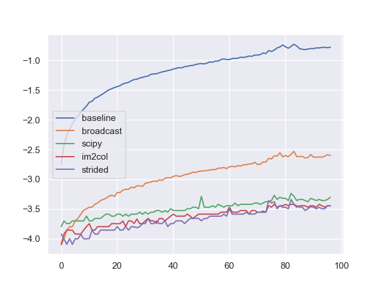
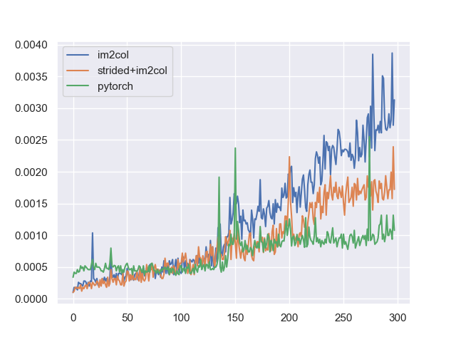

# FastConv

使用NumPy实现1d和2d卷积，直接实现需要多重循环，比如二维卷积的代码：

```python
for i in range(N):
    for j in range(self.out_channels):
        for k in range(h_out):
            for l in range(w_out):
                for m in range(in_channels):
                    for row in range(self.kernel_size):
                        for col in range(self.kernel_size):
                            output[i, j, k,
                                    l] += data[i, m, k * stride + row,
                                                l * stride +
                                                col] * kernel[j, m, row,
                                                            col]
```

因此我们尝试各种方法，避免NumPy基础卷积操作中的多重循环：样本循环、卷积循环、通道循环，从而加速卷积过程。

## Conv1d

1. 利用`scipy.ndimage.correlate1d`消除样本循环和卷积循环；
2. 利用NumPy的广播机制消除样本循环和一部分通道循环；
3. 利用类似im2col策略消除大部分循环；
4. 使用im2col+strided策略消除所有循环.

四种方法和baseline的比较（横轴为输入特征数，纵轴为时间的对数，具体实验设置参考[test.py](/src/test.py)，图中的`strided`就是`im2col+strided`方法）



最优两种方法和PyTorch的对比：



## Conv2d

1. 利用`scipy.ndimage.correlate`消除样本循环和卷积循环；
2. 利用NumPy的广播机制消除样本循环和一部分通道循环；
3. 利用im2col策略消除所有循环。
4. ...

## Reference(Updating)

- <https://welts.xyz/2022/05/02/fast_conv/>;
- ...
